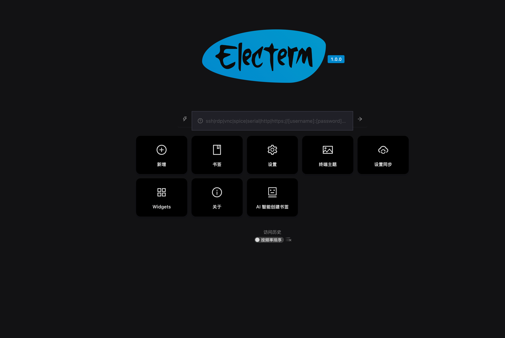
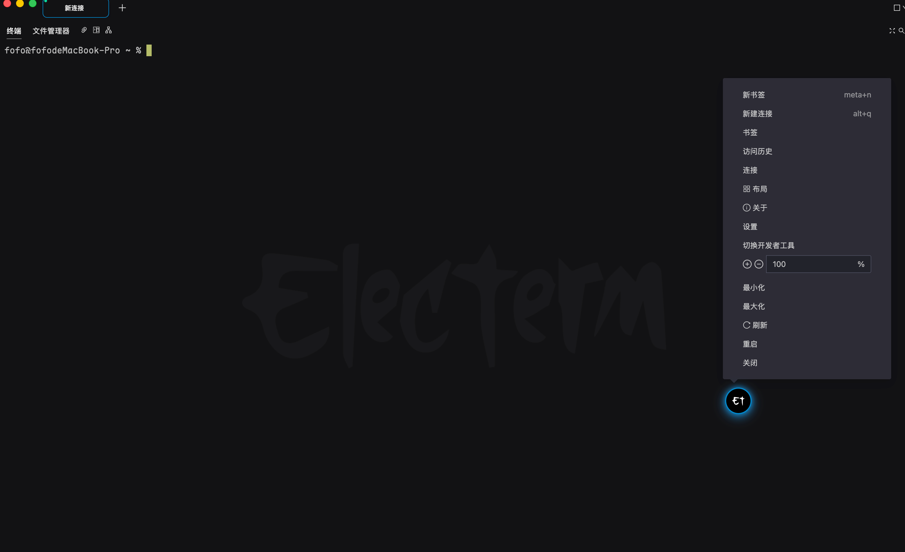
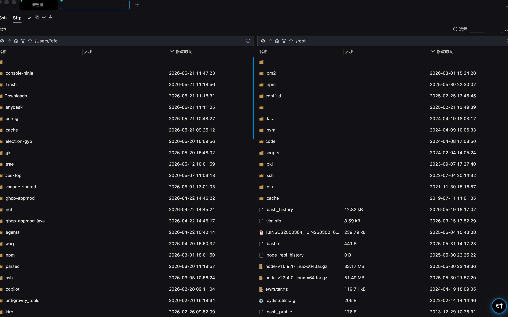

# AuraElecterm (AuraTerm)

> **本项目为** **[electerm](https://github.com/electerm/electerm)** **的高颜值 UI 样式重构版。**
>
> 在完全保留原项目强大的终端、SSH、SFTP 等核心功能的基础上，专注于界面视觉进化、现代 UI 体验以及优雅主题的重塑。
> 本项目基于 **MIT 协议** 开源，并对原作者 [Zhaoxudong (electerm)](https://github.com/electerm) 致以最高敬意。

***

开源终端 / SSH / Telnet / Serialport / RDP / VNC / Spice / SFTP / FTP 客户端（跨平台支持 Linux, macOS, Windows）。

## 重构核心亮点

- **视觉重塑**：引入现代前端视觉规范，优化布局间距、圆角与呼吸感阴影。
- **主题进化**：重构深色/浅色模式的色彩微调，带来更高级的极客审美。
- **原生对齐**：完美继承原版 AI 助手与 MCP 组件，颜值与生产力兼得。

***
## 功能截图展示





## 功能特性

- **多协议支持**：支持 SSH, Telnet, Serialport, RDP, VNC, Spice，集成本地和远程文件管理，提供高效的 SFTP/FTP 文件传输，亦可作为本地终端使用。
- **全平台覆盖**：支持 Windows 7+ (X64/ARM64), macOS 10.15+ (X64/ARM64), Linux (X64/ARM64/Loong64)，以及基于 glibc 2.17+ 的 Linux 发行版（如 UOS 统信、Kylin 麒麟、Ubuntu 18.04 等）。
- **Guake 模式**：支持全局快捷键切换隐藏/显示窗口（默认快捷键 `Ctrl + 2`）。
- **国际化**：支持 🇺🇸 🇨🇳 🇧🇷 🇷🇺 🇪🇸 🇫🇷 🇹🇷 🇭🇰 🇯🇵 🇸🇦 🇩🇪 🇰🇷 🇮🇩 🇵🇱 等多国语言（由 [electerm-locales](https://github.com/electerm/electerm-locales) 驱动）。
- **极客效率**：
  - 双击直接编辑远程文件。
  - 支持密码及 SSH 密钥登录。
  - 内置 Zmodem (`rz`, `sz`) 支持。
  - 支持 SSH 隧道管理。
  - 支持 [Trzsz](https://github.com/trzsz/trzsz) (`trz`/`tsz`)，兼容 tmux。
  - 快速输入命令同步分发到一个或多个终端。
  - 支持命令行调用（详见 [Wiki](https://github.com/electerm/electerm/wiki/Command-line-usage)）。
- **个性化定制**：支持窗口毛玻璃透明（macOS, Windows）、自定义终端背景图片、全功能主题更换以及代理服务器设置。
- **云端同步**：支持将书签等数据同步至 GitHub/Gitee 私人 Gist、WebDAV、自定义服务器或 Electerm 官方云。
- **深度链接 (Deep Link)**：支持通过 `telnet://192.168.2.31:34554` 或 `ssh://user@host:22` 等 URL 唤起客户端直接打开连接（详见 [深度链接支持 Wiki](https://github.com/electerm/electerm/wiki/Deep-link-support)）。
- \*\* 智能化集成\*\*：
  - **AI 助手**：深度集成 AI 能力（支持 DeepSeek、OpenAI 等主流 API），协助进行命令建议、脚本编写，并能一键解释所选终端文本。
  - **MCP 组件**：内置 Model Context Protocol (MCP) 组件，用于 AI 助手与外部工具链的深度协同（详见 [MCP 挂件使用指南](https://github.com/electerm/electerm/wiki/MCP-Widget-Usage-Guide)）。

***

## 官方原版安装路径

如果你需要使用官方原版稳定编译包，可以通过以下渠道：

- **macOS 用户**：`brew install --cask electerm`
- **Linux Snap**：`sudo snap install electerm --classic`
- **Linux 软件商店**：广泛内置于 Ubuntu, Deepin, Mint 等发行版商店中。
- **绿色版**：不支持 `rpm`, `deb` 或 `snap` 的 Linux 发行版可直接解压 `tar.gz` 版本使用。

***

## 调试与开发环境

项目推荐使用 `fnm` (Fast Node Manager) 来管理 Node.js 版本。

> ⚠️ **运行前提**：
>
> 1. 本项目必须使用 **Node.js 24.x** 版本。
> 2. 原项目脚本基于 Linux 环境编写。若在 **macOS** 上运行，请确保已安装 Xcode 命令行工具 (`xcode-select --install`)，并配置国内镜像源以防 Electron 壳子下载失败。

### 国内网络优化（Electron 镜像配置）

```bash
npm config set legacy-peer-deps true
npm config set electron_mirror "[https://npmmirror.com/mirrors/electron/](https://npmmirror.com/mirrors/electron/)"

```

### 开发环境运行

```bash
# 1. 克隆并安装依赖
git clone git@github.com:your-username/AuraElecterm.git
cd AuraElecterm
npm i

# 2. 启动 Vite 本地开发服务器（占用 5570 端口）
npm start

# 3. 在另一个独立的终端会话中，运行 Electron 客户端应用程序
npm run app

```

### 代码质量规范

```bash
# 代码格式检查
npm run lint

# 代码格式自动修复
npm run fix

```

***

## 自动化测试

```bash
# 编译并准备测试环境
npm run b
npm run prepare-test
cp .sample.env .env

# 编辑 .env 文件，填入你的测试机 IP/用户名/密码（测试环境建议在 macOS 下运行）
npm run test

```

***

## 生产环境构建

### 构建 macOS 版本

```bash
# 构建前确保已全局安装 yarn（由于依赖 yarn autoclean 优化体积）
npm i
npm run b
# 构建 macOS 版本
./node_modules/.bin/electron-builder --mac
# 解决超时问题，单次打包一次性
ELECTRON_MIRROR="https://npmmirror.com/mirrors/electron/" ./node_modules/.bin/electron-builder --mac
# 产物请检查 dist/ 目录

```


### Mac 环境下 Electron-Builder 离线打包与组件缓存指南

在 macOS (Apple Silicon / Intel) 环境下使用 `electron-builder` 打包输出 `.dmg` 格式时，通常需要动态下载依赖的底层构建工具 `dmg-builder`。在内网、无网或国内镜像源（如阿里 npmmirror）文件缺失的环境下，常遇到以下连环阻碍：
1. **404 错误**：国内各大镜像源上缺失某些特定版本的 `dmg-builder-bundle` 压缩包。
2. **协议不支持**：`electron-builder` 底层下载库不支持 `ELECTRON_BUILDER_BINARIES_MIRROR="file://..."` 这种本地文件协议。
3. **哈希校验失败**：即使通过本地网络成功喂给它压缩包，也会因为版本差异或内置硬编码导致 `checksum did not match` 的报错。

为了彻底绕过网络下载和哈希校验阶段，可采用 —— 直接将构建工具解压至 macOS 的全局缓存目录中。

---

### 离线缓存离线步骤

当打包日志卡在以下位置并报错时：
• downloading     release=dmg-builder@1.2.0 file=dmgbuild-bundle-arm64-75c8a6c.tar.gz
⨯ Generated checksum for "dmgbuild-bundle-arm64-75c8a6c.tar.gz" did not match expected checksum.
请按照以下两步手动注入缓存，即可直接跳过网络检测：
1. 准备离线依赖包
确保你本地或通过其他渠道已下载好对应的压缩包：

包名示例：dmgbuild-bundle-arm64-75c8a6c.tar.gz

对应组件与版本：dmg-builder 版本的 1.2.0 版本
（https://github.com/electron-userland/electron-builder-binaries）下载
2. 注入全局缓存 (macOS)
打开终端，执行以下命令。它会创建 electron-builder 专用的本地缓存目录，并将你准备好的压缩包直接解压进去：
```bash
# 创建目标的本地缓存版本目录
mkdir -p ~/Library/Caches/electron-builder/v2/dmg-builder/dmg-builder-1.2.0

# 将你的压缩包解压到刚才创建的缓存目录中 (请根据实际情况替换下方的压缩包路径)
tar -zxvf ./build-binaries/dmgbuild-bundle-arm64-75c8a6c.tar.gz -C ~/Library/Caches/electron-builder/v2/dmg-builder/dmg-builder-1.2.0
```
3. 执行纯净打包
缓存注入成功后，electron-builder 在运行时会优先检索该缓存目录。一旦发现文件已存在，它将完全跳过网络请求与哈希校验流程。

现在可以移除任何临时配置的镜像环境变量，执行最纯净的本地打包命令：

```bash
WORKFLOW_NAME="Aura" ./node_modules/.bin/electron-builder --mac
```
构建Windows版本遇到相同问题也可以按照以上步骤操作。


### 构建Windows版本 

Windows 的 .exe 可以在 Windows 本地构建，也可以在 Linux/Mac 下跨平台构建。但如果在非 Windows 系统下跨平台构建，可能无法嵌入非标准图标，建议在 Windows 虚拟机或电脑上运行以下命令。

```bash
# 安装依赖并打包
npm i
npm run b

# 构建 Windows 64位安装包 (.exe)
./node_modules/.bin/electron-builder --win nsis --x64

# 如果需要构建绿色版 (免安装 Zip 压缩包)
./node_modules/.bin/electron-builder --win zip --x64
# 最终的安装包和免安绿色版都会输出在项目根目录的 dist/ 文件夹下
```

***

## 上游代码同步规范 (Git Rebase)

为了确保我们的高颜值重构样式不与原作者的频繁更新产生冲突，请务必使用 **Rebase（变基）** 流程来融合代码：

```bash
# 1. 关联原作者上游仓库（仅需设置一次）
git remote add upstream git@github.com:electerm/electerm.git
git config --global pull.rebase true

# 2. 日常同步流
git stash                  # 暂存当前未提交的样式改动
git fetch upstream         # 拉取官方最新代码
git rebase upstream/master # 将官方代码垫底，把我们的样式提交重放在最顶层
git stash pop              # 恢复手头改动，并在 VS Code 中处理冲突

```

***

## 开源许可证与鸣谢

- 本项目基于 **[MIT License](https://www.google.com/search?q=LICENSE)** 开源。
- 核心底层与功能逻辑完全归属于原开源项目 **[electerm/electerm](https://github.com/electerm/electerm)** 及其全体贡献者。
- 感谢原作者 **[Zhaoxudong](https://github.com/electerm)** 维护了如此优秀的开源终端工具，让视觉重构得以站在巨人的肩膀上。

